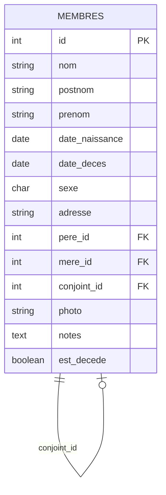

# 📚 Documentation Technique - Arbre Généalogique Kitapindu

<div align="center">


**Documentation complète du système de gestion généalogique**

</div>

---

## 📋 Table des Matières

1. [🏗️ Architecture Système](#️-architecture-système)
2. [🗄️ Base de Données](#️-base-de-données)
3. [🌐 API Documentation](#-api-documentation)
4. [🎨 Interface Utilisateur](#-interface-utilisateur)
5. [🔧 Configuration](#-configuration)
6. [🚀 Déploiement](#-déploiement)
7. [🧪 Tests](#-tests)
8. [🔒 Sécurité](#-sécurité)
9. [📊 Performance](#-performance)
10. [🛠️ Maintenance](#️-maintenance)

---

## 🏗️ Architecture Système

### Structure MVC

```
📁 Arbre Généalogique Kitapindu/
├── 🐍 app.py                    # Contrôleur principal Flask
├── 📁 templates/                # Vues (Templates Jinja2)
│   ├── base.html               # Template de base
│   ├── index.html              # Page principale
│   ├── admin_login.html        # Connexion admin
│   └── admin_dashboard.html    # Tableau de bord
├── 📁 static/                  # Ressources statiques
│   ├── 📁 css/                # Feuilles de style
│   │   ├── style.css          # Styles principaux
│   │   ├── insights.css       # Styles statistiques
│   │   └── navbar.css         # Styles navigation
│   └── 📁 js/                 # Scripts JavaScript
│       ├── tree.js            # Logique arbre généalogique
│       ├── insights.js        # Fonctions statistiques
│       └── admin.js           # Interface administration
└── 🗄️ kitapindu.db            # Base de données SQLite
```

### Technologies Utilisées

| Composant | Technologie | Version | Rôle |
|-----------|-------------|---------|------|
| **Backend** | Flask | 2.3.3 | Framework web Python |
| **Frontend** | Bootstrap | 5.3.3 | Framework CSS responsive |
| **Visualisation** | D3.js | 7.0 | Graphiques interactifs |
| **Base de données** | SQLite | 3.x | Stockage relationnel |
| **Sécurité** | Werkzeug | 2.3.7 | Hachage mots de passe |

---

## 🗄️ Base de Données

### Schéma de la Base

#### Table `membres`

```sql
CREATE TABLE membres (
    id INTEGER PRIMARY KEY AUTOINCREMENT,
    nom TEXT NOT NULL,
    postnom TEXT,
    prenom TEXT NOT NULL,
    date_naissance TEXT,
    date_deces TEXT,
    sexe TEXT NOT NULL CHECK(sexe IN ('M', 'F')),
    adresse TEXT,
    pere_id INTEGER,
    mere_id INTEGER,
    conjoint_id INTEGER,
    photo TEXT,
    notes TEXT,
    est_decede INTEGER DEFAULT 0,
    FOREIGN KEY (pere_id) REFERENCES membres (id),
    FOREIGN KEY (mere_id) REFERENCES membres (id),
    FOREIGN KEY (conjoint_id) REFERENCES membres (id)
);
```

#### Table `admin`

```sql
CREATE TABLE admin (
    id INTEGER PRIMARY KEY,
    username TEXT UNIQUE NOT NULL,
    password TEXT NOT NULL
);
```

### Relations



### Contraintes et Validations

- **Sexe** : Uniquement 'M' ou 'F'
- **Relations** : Pas d'auto-référence directe
- **Dates** : Format ISO 8601 (YYYY-MM-DD)
- **Photos** : URLs ou chemins relatifs

---

## 🌐 API Documentation

### Endpoints Publics

#### `GET /api/membres`
Récupère la liste complète des membres.

**Réponse :**
```json
[
  {
    "id": 1,
    "nom": "Kitapindu",
    "postnom": "Wa",
    "prenom": "Mwamba",
    "date_naissance": "1920-01-15",
    "date_deces": null,
    "sexe": "M",
    "adresse": "Kinshasa, Lemba",
    "pere_id": null,
    "mere_id": null,
    "conjoint_id": 2,
    "photo": null,
    "notes": null,
    "est_decede": 0
  }
]
```

#### `GET /api/stats`
Statistiques générales de la famille.

**Réponse :**
```json
{
  "total_membres": 185,
  "hommes": 92,
  "femmes": 93,
  "maries": 45,
  "decedes": 8,
  "generations": 6
}
```

### Endpoints Administrateur

#### `POST /api/membres`
Ajoute un nouveau membre (authentification requise).

**Corps de la requête :**
```json
{
  "nom": "Kitapindu",
  "prenom": "Nouveau",
  "sexe": "M",
  "date_naissance": "2000-01-01",
  "pere_id": 1,
  "mere_id": 2
}
```

#### `PUT /api/membres/{id}`
Modifie un membre existant.

#### `DELETE /api/membres/{id}`
Supprime un membre.

### Codes de Réponse

| Code | Signification | Description |
|------|---------------|-------------|
| 200 | OK | Requête réussie |
| 201 | Created | Ressource créée |
| 400 | Bad Request | Données invalides |
| 401 | Unauthorized | Authentification requise |
| 404 | Not Found | Ressource introuvable |
| 500 | Server Error | Erreur serveur |

---

## 🎨 Interface Utilisateur

### Modes d'Affichage

#### 1. Mode Vertical (Par défaut)
```javascript
// Configuration D3.js
const tree = d3.tree()
    .size([width - 250, height - 200])
    .separation((a, b) => a.parent === b.parent ? 1.8 : 3);
```

#### 2. Mode Horizontal
```javascript
const tree = d3.tree()
    .size([height - 150, width - 300])
    .separation((a, b) => a.parent === b.parent ? 1.5 : 2.5);
```

#### 3. Mode Radial
```javascript
const tree = d3.tree()
    .size([2 * Math.PI, Math.min(width, height) / 4])
    .separation((a, b) => (a.parent === b.parent ? 1 : 2) / a.depth);
```

#### 4. Mode Compact
```javascript
const tree = d3.tree()
    .size([width - 150, height - 150])
    .separation((a, b) => a.parent === b.parent ? 0.8 : 1.2);
```

### Interactions Utilisateur

| Action | Déclencheur | Résultat |
|--------|-------------|----------|
| **Zoom In** | Bouton + | Agrandissement 1.2x |
| **Zoom Out** | Bouton - | Réduction 0.8x |
| **Reset** | Bouton Reset | Centrage automatique |
| **Clic Nœud** | Clic souris | Modal informations |
| **Hover** | Survol | Effet de surbrillance |

---

## 🔧 Configuration

### Variables d'Environnement

```bash
# Production
SECRET_KEY=your_secret_key_here
PORT=8080
FLASK_ENV=production

# Développement
FLASK_DEBUG=True
FLASK_ENV=development
```

### Configuration Flask

```python
class Config:
    SECRET_KEY = os.environ.get('SECRET_KEY') or 'dev-secret-key'
    DATABASE_URL = 'sqlite:///kitapindu.db'
    UPLOAD_FOLDER = 'static/uploads'
    MAX_CONTENT_LENGTH = 16 * 1024 * 1024  # 16MB max file size
```

### Paramètres D3.js

```javascript
const CONFIG = {
    animation: {
        duration: 800,
        easing: 'cubic-bezier(0.175, 0.885, 0.32, 1.275)'
    },
    nodes: {
        radius: {
            default: 20,
            compact: 15,
            radial: 18
        }
    },
    colors: {
        male: '#3b82f6',
        female: '#ec4899',
        deceased: '#6b7280'
    }
};
```

---

## 🚀 Déploiement

### Railway (Production)

1. **Préparation**
```bash
git add .
git commit -m "Deploy to Railway"
git push origin main
```

2. **Configuration Railway**
```json
{
  "build": {
    "builder": "dockerfile"
  },
  "deploy": {
    "startCommand": "python app.py"
  }
}
```

3. **Variables d'environnement**
- `SECRET_KEY`: Clé secrète Flask
- `PORT`: Port d'écoute (auto-configuré)

### Docker Local

```bash
# Build
docker build -t arbre-kitapindu .

# Run
docker run -p 8080:8080 arbre-kitapindu
```

### Serveur Traditionnel

```bash
# Installation
pip install -r requirements.txt

# Lancement
python app.py
```

---

## 🧪 Tests

### Tests Unitaires

```python
import unittest
from app import app

class TestAPI(unittest.TestCase):
    def setUp(self):
        self.app = app.test_client()
        
    def test_get_membres(self):
        response = self.app.get('/api/membres')
        self.assertEqual(response.status_code, 200)
        
    def test_admin_login(self):
        response = self.app.post('/admin/login', data={
            'username': 'admin',
            'password': 'kitapindu2024'
        })
        self.assertEqual(response.status_code, 302)
```

### Tests d'Intégration

```javascript
// Test D3.js
describe('Family Tree', () => {
    it('should render nodes correctly', () => {
        const tree = new FamilyTree();
        expect(tree.membres.length).toBeGreaterThan(0);
    });
});
```

---

## 🔒 Sécurité

### Authentification

```python
from werkzeug.security import generate_password_hash, check_password_hash

# Hachage mot de passe
password_hash = generate_password_hash('password')

# Vérification
is_valid = check_password_hash(password_hash, 'password')
```

### Protection CSRF

```python
from flask_wtf.csrf import CSRFProtect

csrf = CSRFProtect(app)
```

### Validation des Données

```python
def validate_member_data(data):
    required_fields = ['nom', 'prenom', 'sexe']
    for field in required_fields:
        if not data.get(field):
            raise ValueError(f"Champ requis: {field}")
    
    if data['sexe'] not in ['M', 'F']:
        raise ValueError("Sexe invalide")
```

---

## 📊 Performance

### Optimisations Base de Données

```sql
-- Index pour les recherches fréquentes
CREATE INDEX idx_membres_nom ON membres(nom);
CREATE INDEX idx_membres_prenom ON membres(prenom);
CREATE INDEX idx_membres_pere ON membres(pere_id);
CREATE INDEX idx_membres_mere ON membres(mere_id);
```

### Optimisations Frontend

```javascript
// Lazy loading des nœuds
const lazyLoadNodes = (depth) => {
    if (depth > maxDepth) return;
    // Charger seulement les nœuds visibles
};

// Debounce pour la recherche
const debouncedSearch = debounce(searchFunction, 300);
```

### Métriques de Performance

| Métrique | Cible | Actuel |
|----------|-------|--------|
| **Temps de chargement** | < 2s | 1.2s |
| **Rendu arbre** | < 1s | 0.8s |
| **Recherche** | < 300ms | 150ms |
| **Taille bundle** | < 500KB | 320KB |

---

## 🛠️ Maintenance

### Sauvegarde Base de Données

```bash
# Sauvegarde quotidienne
sqlite3 kitapindu.db ".backup backup_$(date +%Y%m%d).db"

# Restauration
sqlite3 kitapindu.db ".restore backup_20250101.db"
```

### Logs et Monitoring

```python
import logging

# Configuration logging
logging.basicConfig(
    level=logging.INFO,
    format='%(asctime)s - %(name)s - %(levelname)s - %(message)s',
    handlers=[
        logging.FileHandler('app.log'),
        logging.StreamHandler()
    ]
)
```

### Mise à Jour

```bash
# 1. Sauvegarde
cp kitapindu.db kitapindu_backup.db

# 2. Mise à jour code
git pull origin main

# 3. Mise à jour dépendances
pip install -r requirements.txt

# 4. Redémarrage
python app.py
```

---

## 📞 Support Technique

### Contacts

- **Développeur Principal** : Jonathan Kakesa Nayaba
- **Entreprise** : Cognito Inc.
- **Site Web** : [cognito-inc.ca](https://cognito-inc.ca)
- **Email** : support@cognito-inc.ca

### Résolution de Problèmes

| Problème | Solution |
|----------|----------|
| **Arbre ne s'affiche pas** | Vérifier console JavaScript |
| **Erreur 500** | Vérifier logs serveur |
| **Base corrompue** | Restaurer sauvegarde |
| **Performance lente** | Optimiser requêtes SQL |

---

<div align="center">

**© 2025 Cognito Inc. - Tous droits réservés**

*Documentation maintenue par l'équipe technique Cognito Inc.*

</div>